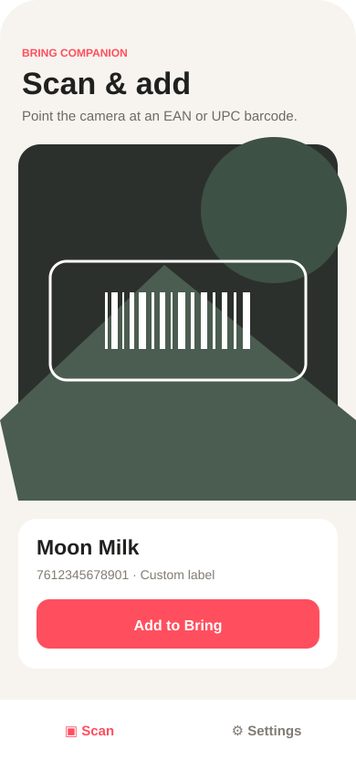

# Bring Scanner

> [!IMPORTANT]
> **This entire repository, including the application, design, tests, documentation, and deployment setup was made with AI.**

An unofficial React Native iOS companion that scans EAN/UPC barcodes, resolves product names, and adds them to a selected Bring shopping list.



## Features

- EAN-8, EAN-13, UPC-A, and UPC-E scanning with the device camera
- Free product lookup through Open Food Facts
- Household, beauty, and pet-product lookup through the Open Facts product family
- Automatic or selected product language with localized-name fallback
- Generic, exact, or ask-every-time Bring item labels
- Custom barcode-to-label mappings that override online results
- Bring credential entry and shopping-list selection
- Keychain-backed credential storage with `expo-secure-store`
- Confirmation before an item is added, including the EAN as its specification

## Run locally

Requirements: Node.js 22, npm, Xcode, and an iPhone or iOS simulator. A physical device is needed for camera scanning.

```sh
npm ci
npm run ios
```

Before running the app, create an ignored `.env` file:

```sh
cp .env.example .env
```

Set `EXPO_PUBLIC_BRING_API_KEY` in that file. For EAS builds, configure the same variable in the Expo project environment. Expo public environment variables are embedded in the compiled app, so this keeps the value out of Git but does not make a mobile client key cryptographically secret.

Useful device shortcuts:

```sh
npm run ios:device   # Debug build on a connected iPhone
npm run ios:release  # Standalone Release build on a connected iPhone
npm run dev:tunnel   # Metro dev server reachable through an Expo tunnel
```

`ios:device` opens Expo's eligible-device picker. To target a device directly without the picker, pass its name locally:

```sh
npm run ios:device -- "Your iPhone Name"
```

Do not commit a personal device name or UDID to the repository.

Run verification with:

```sh
npm run format:check
npm run lint
npm run typecheck
npm test
npm run test:e2e
npm run build
```

Automatically format the codebase and apply safe ESLint fixes with:

```sh
npm run fix
```

## Privacy and service notes

Credentials are stored only in secure device storage and are never written to source files or regular app storage. Shopping-list selection and custom barcode mappings remain on the device.

Bring does not provide a documented public API for its shopping-list app. This project uses an isolated, unofficial adapter based on the web API and may stop working when that API changes. It is not affiliated with or endorsed by Bring! Labs AG.

Product information comes from [Open Food Facts](https://world.openfoodfacts.org/) and is available under the Open Database License. Coverage and labels vary by country and contributor data.

## License

MIT — see [LICENSE](LICENSE).
